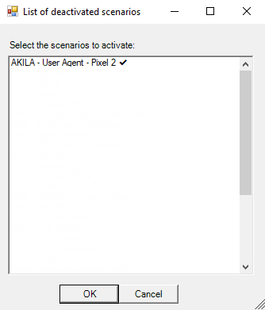

# Ekara-Enable_scenario

<a href="https://api.ekara.ip-label.net/"> 

## Description
This [Powershell](https://learn.microsoft.com/powershell/scripting/overview) script allows you to activate several [Ekara](https://ekara.ip-label.net/) scenarios.

For this, the script uses the Rest Ekara API.

## Screens

## Requirements

-|version
--|:--:
Ekara plateform|>=23.12
PowerShell|>=5
.NET|>=4
Microsoft Excel|>=2013

(Account and password Ekara)

## Download

[github-download]: https://github.com/MrGuyTwo/Ekara-Enable_scenario/releases
 - [`Ekara-Enable_scenario`][github-download]

## The main function
Methods called : 

- auth/login
- adm-api/scenarios
- adm-api/scenario/{ScenatioID}/start
